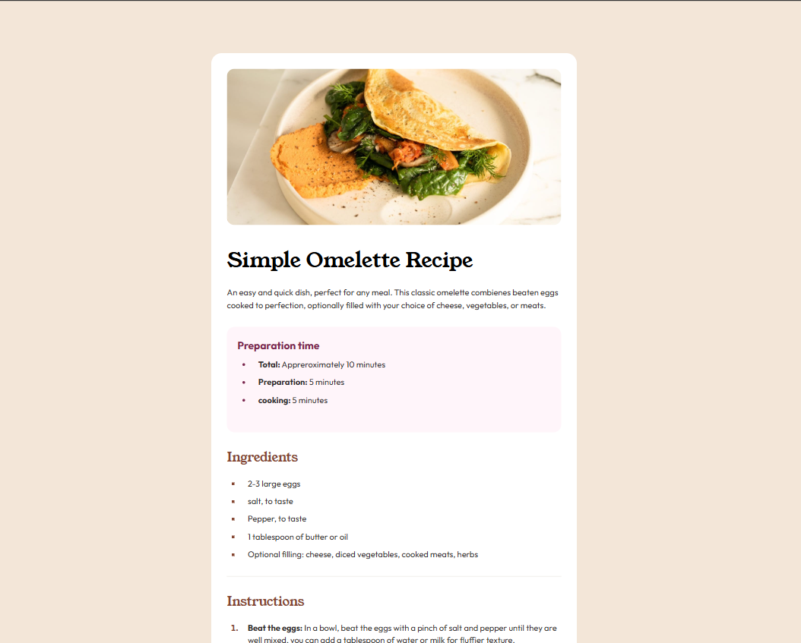
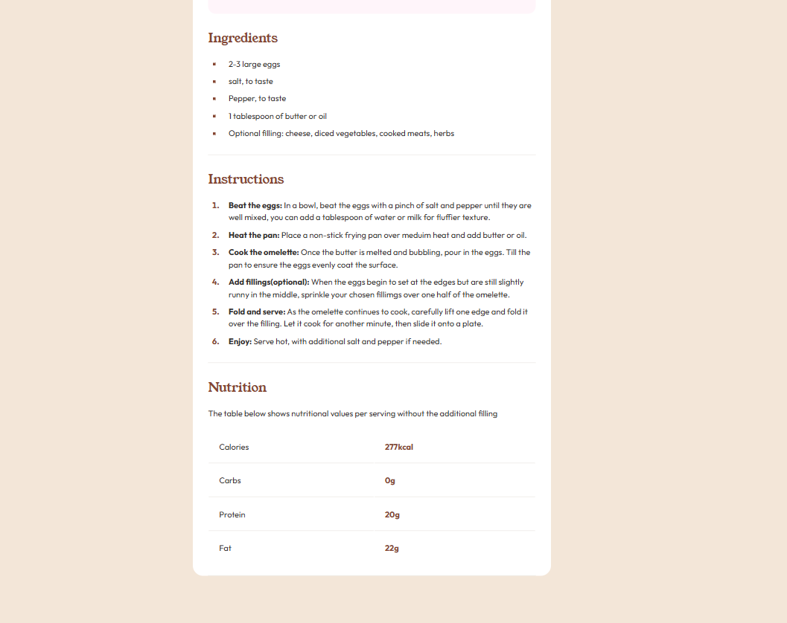
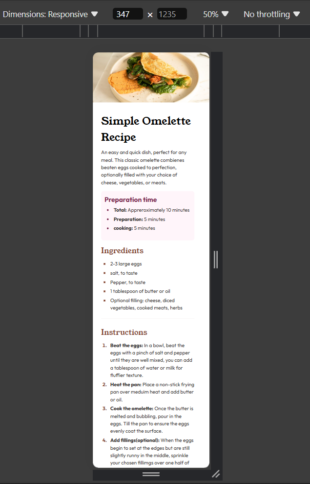

# ReceipePageChallenge
 this is frontend mentor challenge

# Frontend Mentor - Recipe page solution

This is a solution to the [Recipe page challenge on Frontend Mentor](https://www.frontendmentor.io/challenges/recipe-page-KiTsR8QQKm). Frontend Mentor challenges help you improve your coding skills by building realistic projects. 

## Table of contents

  - [Screenshot](#screenshot)
  - [Links](#links)
  - [Built with](#built-with)
  - [What I learned](#what-i-learned)
  - [Useful resources](#useful-resources)
- [Author](#author)


### Screenshot






### Links

- Solution URL: (https://github.com/IZY-BOY/ReceipePageChallenge.git)
- Live Site URL: (https://izy-boy.github.io/ReceipePageChallenge/)


### Built with

- Semantic HTML5 markup
- CSS custom properties


### What I learned

```css
li::marker{
    color: hsl(14, 45%, 36%);
    font-weight: 700;
}
```

### Useful resources

- (https://www.hallme.com/blog/using-marker-to-style-your-lists/) - This helped me learn more about styling list marker

## Author

- Frontend Mentor - [@IZY_BOY](https://www.frontendmentor.io/profile/IZY_BOY)

